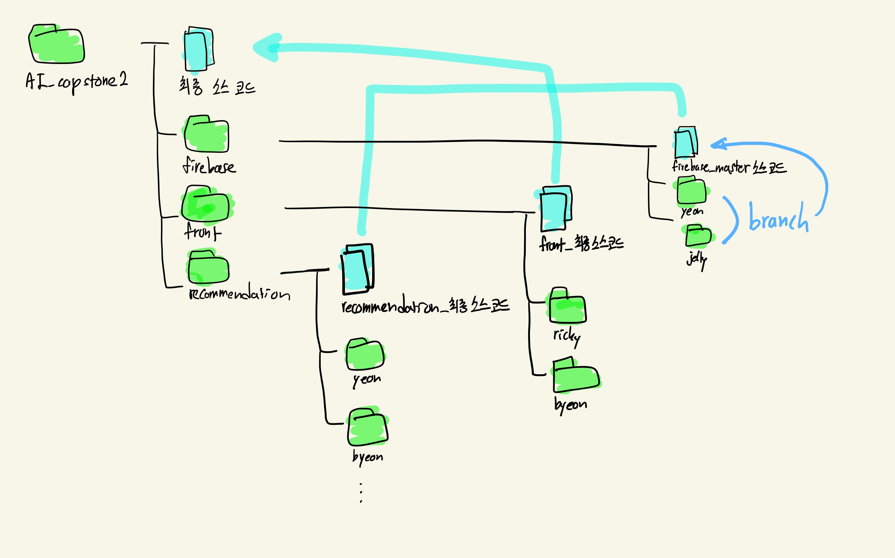

# AI융합캡스톤디자인2 - 퇴직자 온라인 미팅 플랫폼(A2I2)

- 폴더(디렉터리) 단위로 firebase, frontend, recommedation ...으로 **상위 디렉터리**를 생성하여 관리합니다.
- 각 **상위 디렉터리** 아래 firebase/yeon ... 등으로 개별적인 branches를 만들어 커밋하고 pull request를 합니다.
- merge는 master branch를 정하고 난 후, 팀원이 모두 검토 후 진행합니다.
- ex) 상위 디렉터리인 firebase 아래에는 master branch가 있고, firebase/yeon, firebase/seonwoo ...방식으로 각자의 branches가 있게 됩니다.

